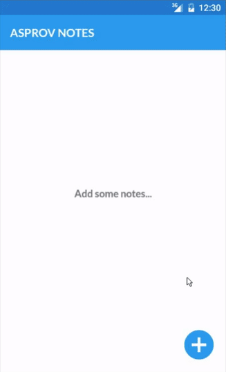

# Asprov-Notes
A simple notes taking application. Built on top of react-native, redux, native android navigator and redux-store for persistent data storage.

[Installable APK](https://github.com/shoumma/Asprov-Notes/raw/master/apk/AsprovNotes.apk)



## Built with
* [React Native 0.29] (https://facebook.github.io/react-native/)
* [Redux] (https://github.com/reactjs/redux)
* [React-Redux] (https://github.com/reactjs/react-redux)
* [Redux Storage] (https://github.com/michaelcontento/redux-storage)

## Build and run
### Install npm modules
```
npm install
```

### Run android
```
react-native run-android
```

### Run the JS server
```
react-native start
```

## License
[MIT] (https://github.com/shoumma/Asprov-Notes/blob/master/LICENSE) License

Made with ♥ by [Provash Shoumma](https://twitter.com/pshoumma)
